# Algorithms and Data Structures Enhancement

### Artifact

For this enhancement, I selected my OpenGL 3D scene project as the primary artifact. The original project focused on using Visual Studio to render a 3D scene, including texture, material and lighting, from a picture reference. I chose to challenge myself and rendered a bookshelf scene, containing books, candles, crystal balls and many other objects.

  

Unfortunately, the limitations of OpenGL and of the coding template forced me to stay within a maximum of 16 textures. My enhancement is designed to demonstrate my ability to refactor code to allow for more scalability, while recognizing performance trade-offs, by overcoming that limitation by changing the search and storage methods used in texturing rendering.

Purpose of the Enhancement
* Support for unlimited texture usage at runtime
* Improved texture searching through an unordered map
* RenderCommand structure for storing object rendering data
* Grouping objects by texture rather than drawing objects individually using an unordered map
* Reduction of redundant texture binding operations
* Performance improvements within the RenderScene loop

### Technical Approach and Design Decisions

The original implementation loaded textures into a fixed set of OpenGL texture slots. While functional, this approach introduced a limitation on the number of textures available in the scene. Each texture required a dedicated slot, limiting expansion and making future additions more difficult.

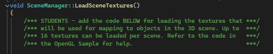

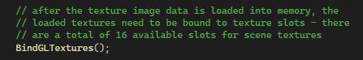

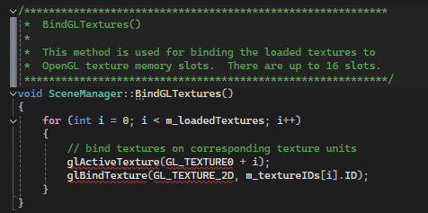

To address this issue, I removed the vector responsible for storing textures, and the affiliated method, and replaced it with an unordered map. The plan was to choose bind textures during runtime, rather than all at once before rendering the scene, and simply replacing the active texture as each mesh was rendered. Unfortunately, the processing would take a hit doing searches to the vector with every call to RenderScene, since searching by value with a vector has O(n) time complexity, so that’s why I chose an unordered map instead, which is O(1) on average, with O(n) as its worst-case. So I set out refactoring all areas that called the vector, and began replacing them with calls to the unordered map instead.

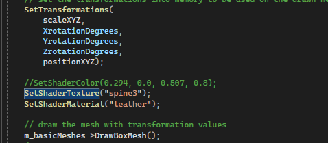

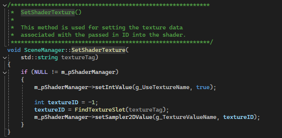

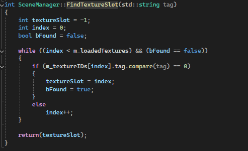

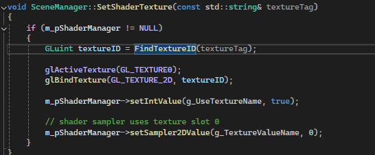

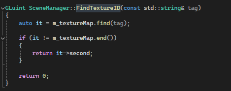

Still, even though the vector searches were called with every rendering, and I improved that by calling the unordered map, I wanted to improve upon the fact that I was binding and unbinding textures repeatedly and redundantly during my RenderScene() call. The call to CreateBooks involved me binding and unbinding the “pages” texture multiple times, despite my knowing I would use it again in the next book.

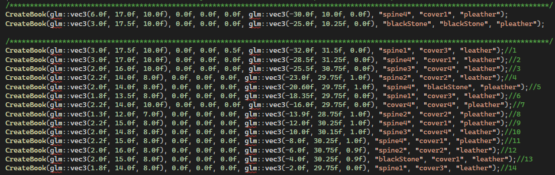

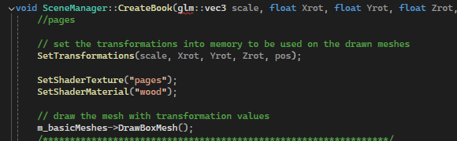

So, I decided I could improve upon that by grouping the usages of each texture, and have them called together. This would mean all usages of the texture “pages” would be rendered at once, then that texture would be replaced with the next texture, and all of those usages would be rendered at once, and so on. This removed the redundancy I recognized and was accomplished using another unordered map, but this one stored the instructions of each object that would be rendered in a struct and assigned that struct to the texture it used as the key.

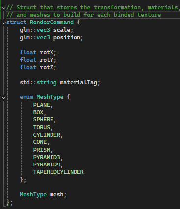

Prior to the RenderScene() call, the PrepareScene renders all of the objects and stores their information in the struct according to their texture key.Then  the RenderScene() function iterates through the map, binds a texture once, and then renders every object associated with that texture before moving to the next group.

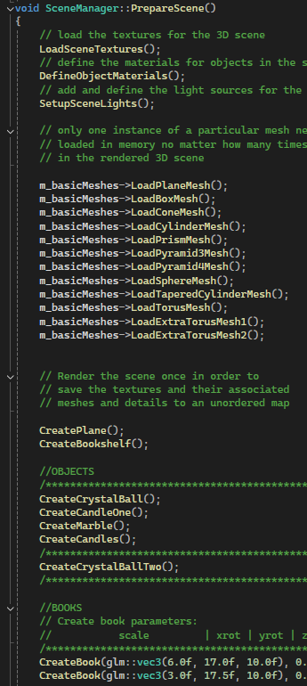 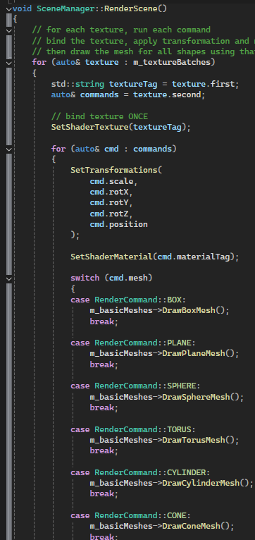

Overall, this design removes the previous texture slot limitation because textures can now be loaded dynamically and retrieved through their tags rather than requiring fixed slot assignments. It also reduces the number of texture binding operations performed during rendering by algorithmically organizing the objects by their texture.

### Performance and Algorithmic Tradeoffs

One of the primary considerations for this enhancement was the fact that RenderScene executes continuously throughout the lifetime of the application. Since this method runs every frame, even small inefficiencies can become significant over time.

The use of an unordered_map provides average-case O(1) lookup performance when retrieving texture groups. This was an improvement on the O(n) time complexity when searching by value through a vector for the texture. The overall rendering process remains O(n) because every object in the scene must still be rendered. But using the unordered_map changed the time complexity from O(n)*O(n), so O(n^2), to O(n) * O(1), or O(n). Still, my RenderScene() does still utilize a vector when running through the command structure, adding an O(n) time complexity to runtime, making my runtime O(n^2) as well. In terms of time complexity, that tradeoff balances out, but now I have access to textures without being concerned about the 16 texture limit.

The primary tradeoff is the use of additional memory to store render commands and texture groupings. In exchange, the rendering system gains improved scalability, cleaner organization, reduced texture binding overhead, and support for a much larger number of textures than the original design.

To prove that I had access to more textures, I replaced the texture of some objects to show my expanded texture capacity.

   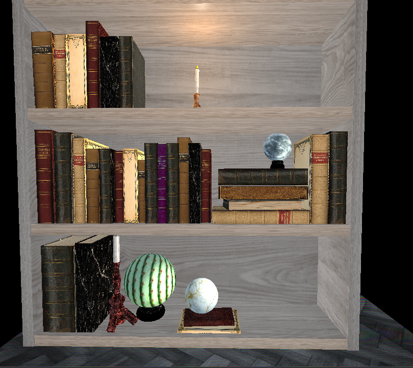

### Skills Demonstrated

* Implemented an unordered_map-based rendering architecture to improve texture organization and lookup efficiency.
* Applied algorithmic analysis by evaluating O(1) hash map access compared to repeated O(n) vector texture lookup.
* Designed a RenderCommand structure that separates scene creation from scene rendering.
* Evaluated tradeoffs between memory usage and rendering efficiency.
* Improved scalability by removing the fixed texture slot limitation and supporting dynamic texture management.
