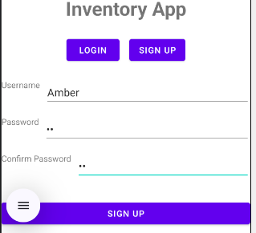
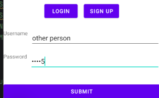
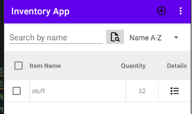
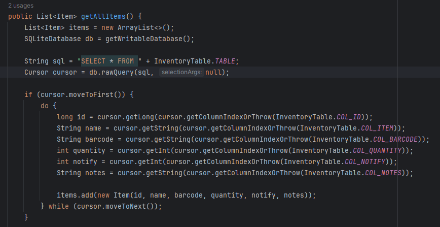
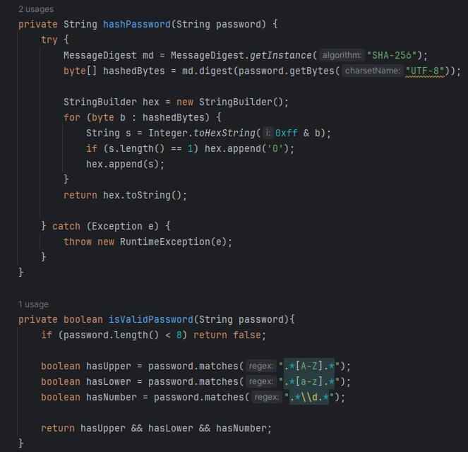
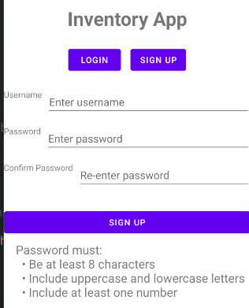
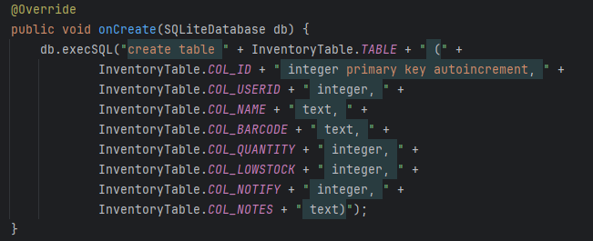
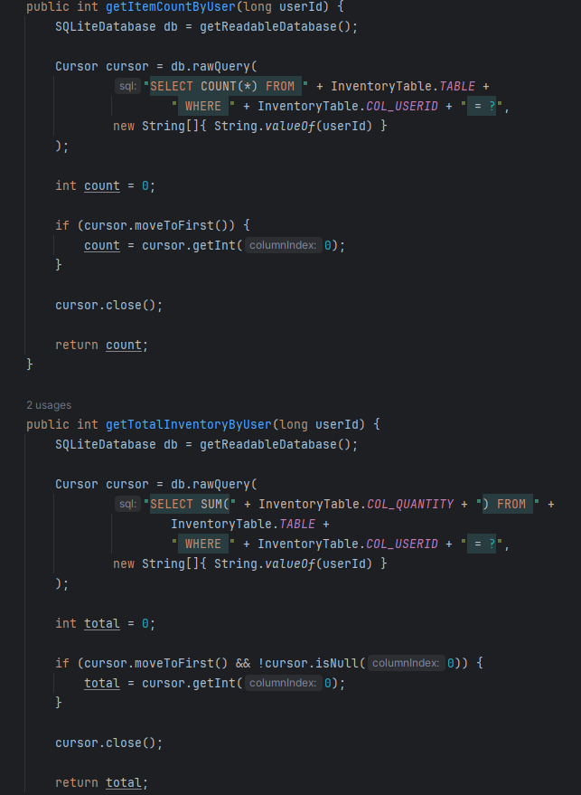

# Database Enhancement

### Artifact

For this enhancement, I selected my Android-based Inventory Management application once again. The original application focused on storing inventory data for a logged in user, providing basic CRUD functionality, but failed to create division between user accounts and their inventories. This enhancement pairs with my first enhancement by creating fuller, interconnected databases, with role based access, user management, data filtering, parameterized queries, and data aggregation. This enhancement was done to demonstrate my ability to design and extend relational databases while balancing functionality, security, and maintainability.

### Purpose of the Enhancement

* Create division between user accounts and inventory access.
* Implement role-based access control using administrator and standard roles.
* Add user management functionality, including viewing and editing user accounts and inventories, and deleting users.
* Implement password hashing for secure credential storage
* Create a low-stock column for custom notification settings per user and inventory.
* Expand database queries to support userId and role based queries
* Create Sum and Count queries to support inventory summaries
* Improve database interaction by reducing redundancy

### Technical Approach and Design Decisions

The database structure was redesigned to support multiple users while maintaining separation between user accounts and inventory records. The previous iteration of the application functioned as an inventory application, but every user accessed the same inventory. This was due to the inventory queries passing SELECT * without any foreign key to specify the user.

  

The login also allowed password inputs of any length or complexity, so I added password hashing and validation to create greater security within the database. 

 

I refactored the database logic to use foreign key query searches, ensuring that inventory access was separated by user. This meant refactoring all queries, and while doing so, I reduced redundancy by creating separate methods for repeated processes. I created a userId, to use as the foreign key, and lowStock column in my database. I also added aggregated queries to create total inventory and user counts and summations.

  

I expanded and improved upon the login database to include user roles in order to create a separate admin experience. In that space, an admin can query the database to view a user list, similar to the inventory list, and can edit user inventories and role-based privileges.
 
They can view all inventories within the database, or only databases for specific users, through the foreign key query, and the totals update depending on view. They can also delete users and items as well.

To support these features, as well as separation of privileges, the foreign key queries and different parameters were utilized according to user role.

### Skills Demonstrated

* Developing and implementing relational database structures to support multiple user and inventory ownership.
* Understanding up CRUD principles in role-based data storage.
* Improving Database security through hashing and input validation.
* Efficient and functional data aggregation.
* Mastery of foreign key data queries.
* Demonstrate an ability to design scalable database solutions.
* Applied software engineering principles to separate data management, business logic, and user interface responsibilities.

- [Original Project](https://github.com/newrosellc/CS-499-Capstone/blob/main/InventoryProjectCS360.zip)
- [Enhanced Project](https://github.com/newrosellc/CS-499-Capstone/blob/main/InventoryProjectUpdated.7z)
