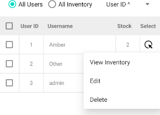

# Software Engineering Enhancement

### Artifact

For this enhancement, I selected my Android-based Inventory Management application as the primary artifact. My enhancement is designed to support standard and administrator role-based access, along with a target-user viewing mode that allows administrators to inspect and manage inventory and account data for specific users, as well as a more secure login process. These enhancements significantly expand the scope of the application by introducing an administrative interface, modular fragment-based architecture, and improved user and inventory management capabilities. The skills I aim to demonstrate are an understanding of scalable software design, improved separation of concerns, and a security mindset. This enhancement pairs with my database enhancement. In order to get the full narrative of the enhancement decisions, it is best to pair the two together for a fuller explanation of what, why, and how this software was refactored.

### Purpose of the Enhancement

* Admin view (all users and all inventory)
* Basic View (fragment container for basic user access)
* User List Fragment (displays a list of the users from the Database)
* Inventory List (displays inventory based upon admin and targeted navigation)
* Target-user inventory inspection mode
* Dialog Fragment to replace detail fragments (User and Item Detail Fragments)
* Password validation and hashing
* Privilege changing via admin view (Allows admin to promote other accounts to the admin role)

### Technical Approach and Design Decisions

The original version of this application had a basic user interface and a simple use-case. In order to improve upon that model and demonstrate my skills in software design and engineering, I chose to expand that user base and allow Administrative access by creating a separate landing page, additional privileges and more informative data tables. The LoginActivity now leads to either the Admin or the Basic Activity, directing navigation. Both landing pages contain the same overall layout, including the floating button, the new footer, the appbar menu, the search bar and the sort-by features. I created an interface to allow both the basic and admin fragments to use the same methods with Override capabilities. This allowed me to take advantage of fragment transactions and cycle between their views and their method calls depending user privilege and requirements.

   

The application was redesigned using a parent-child fragment structure. The AdminFragment acts as the central container, hosting both UserListFragment and InventoryFragment. The BasicFragment hosts only the Inventory fragment. The Admin view displays works with a similar recycler view as the Inventory list. The admin landing page hosts a radio toggle that lets the user switch between viewing all users and all inventory items. The footer updates depending on which view is selected, as well as if the inventory is that of a target user. 

  

 

 

Login now requires a minimum of 8 characters for the password, as well as a capital letter and a number. The requirements are now visible after selecting “Sign up.” The password is hashed using SHA-256 before entering the database for greater security. The role and userId are stored in a Session manager, which keeps account of the user logged in, the time since last active, and the target user selected during admin interactions as well.  For testing, the current way to create an admin account is to use the username **“admin.”** 

 

In the Item Details, the user is now able to set their low stock amount so they may be notified once that custom amount is hit for that particular item, rather than a hardcoded amount that may not be in every user's best interest for every item. The detail fragments are now dialogue fragments, allowing them to overlay the fragments they come from without the need to replace them entirely, reloading the main fragments with every call. This reduces navigation overhead and provides modern interaction. User Details are a new feature, with the only edit ability currently being the ability to change a user’s role. I disabled the ability for the logged in admin user from being able to edit or delete their own account, but they can still view their own details. The footer adapts by active Fragment, and calculates totals via new Database queries. They update after adding items, editing details, and deleting items or users.

 

### Skills Demonstrated

* Application was restructured into a modular, fragment-based architecture that separates UI components and promotes reusability.
* Demonstrated object-oriented design by using fragments and dialog fragments to encapsulate specific responsibilities.
* Uses interface-based callbacks and fragment result communication to coordinate updates between independent components.
* Supports dynamic view switching within a single activity, improving usability while maintaining a clean and scalable navigation structure.
* Introduction of session-based user context allows the application to dynamically adjust behavior based on user role and selected target user.
* Added secure login validation and password hashing to promote security centered software development.

### Source Code

- [Original Project](https://github.com/newrosellc/CS-499-Capstone/blob/main/InventoryProjectCS360.zip)
- [Enhanced Project](https://github.com/newrosellc/CS-499-Capstone/blob/main/InventoryProjectUpdated.7z)
