# Software Engineering Enhancement

### Artifact

For this enhancement, I selected my Android-based Inventory Management application as the primary artifact. My enhancement is designed to support standard and administrator roles, along with a target-user viewing mode that allows administrators to inspect and manage inventory data for specific users, as well as a more secure login process. These enhancements significantly expands the application by introducing an administrative interface, modular fragment-based architecture, and improved user and inventory management capabilities. The skills I aim to demonstrate are an understanding of scalable software design, improved separation of concerns, and a security mindset.

### Purpose of the Enhancement

* Admin view (all users and all inventory)
* Basic View (fragment container for basic user access)
* User List Fragment (displays a list of the users from the Database)
* Inventory List (displays inventory based upon admin and targeted navigation)
* Target-user inventory inspection mode
* Dialog Fragment to replace detail fragments (User and Item Detail Fragments)
* Password validation and hashing
* Privilege changing via admin view (Allows admin to promote other accounts to the admin role)

### Technical Approach and Design Decisions

The original completed application had a basic user interface and use-case. In order to improve upon that model and demonstrate my skills in software design and engineering, I chose to expand that use-case and allow Administrative access by creating a separate landing page and additional privileges and data tables. Both hosts contain the overall layout, including the hover button, the new footer, the appbar menu, the searchbar and the sort by features. The LoginActivity now leads to either the Admin or the Basic Activity, directing navigation. I created an interface to allow both the basic and admin fragment to use the same methods with Override capabilities. This allowed me to take advantage of fragment transaction and cycle between their views and their method calls depending user privilege and needs.

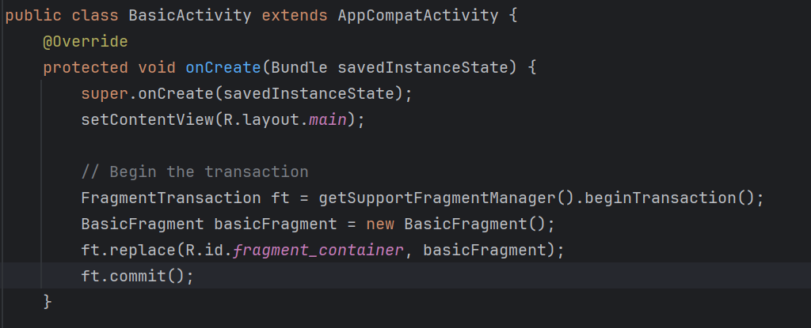 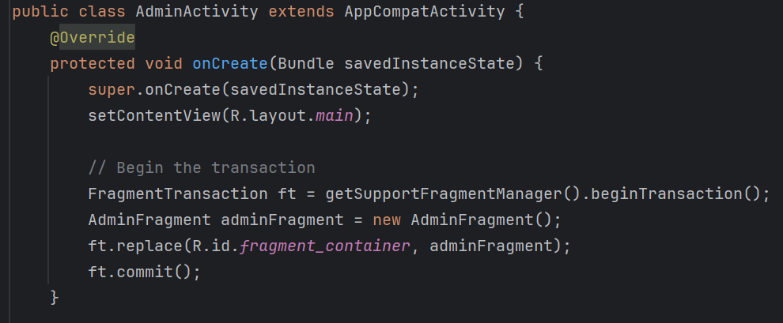 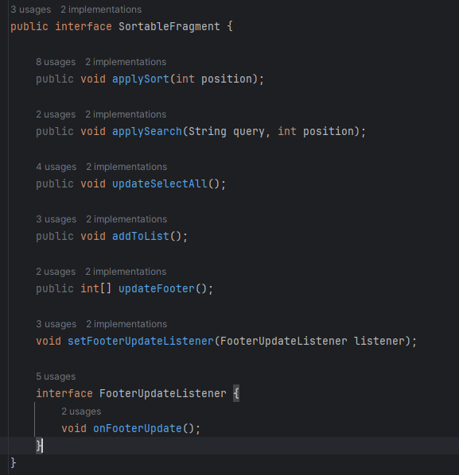 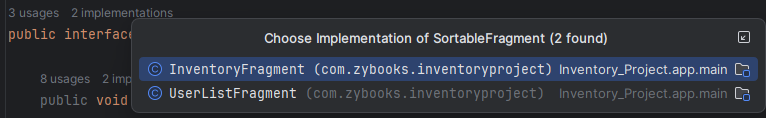

The application was redesigned using a parent-child fragment structure. The AdminFragment acts as the central container, hosting both UserListFragment and InventoryFragment. The BasicFragment hosts only the Inventory fragment. The Admin view displays works with a similar recycler view as the Inventory list. The admin landing page hosts a radio toggle that lets the user switch between viewing all users and all inventory items. The footer updates depending on which view is selected. 

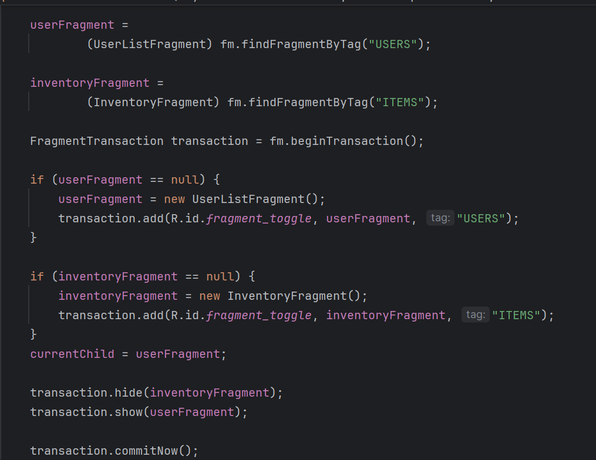 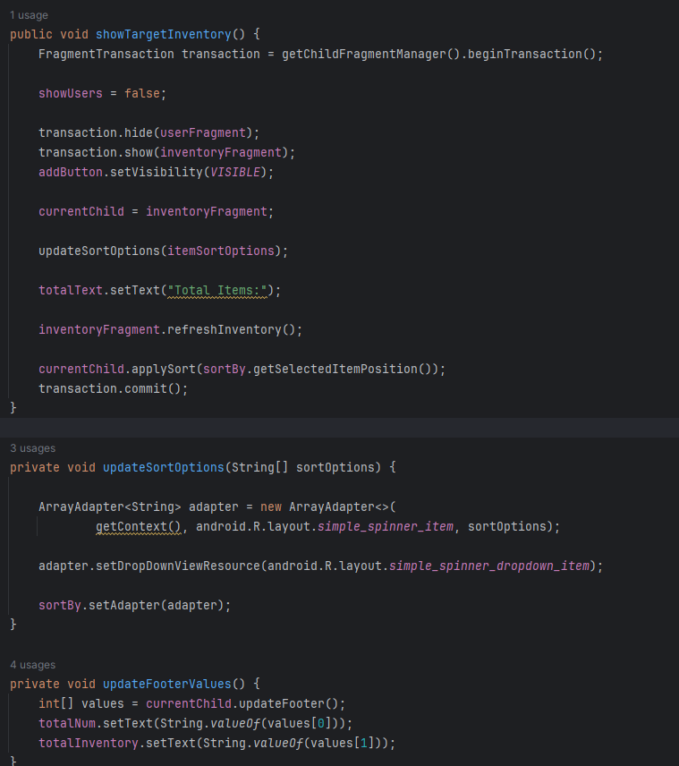 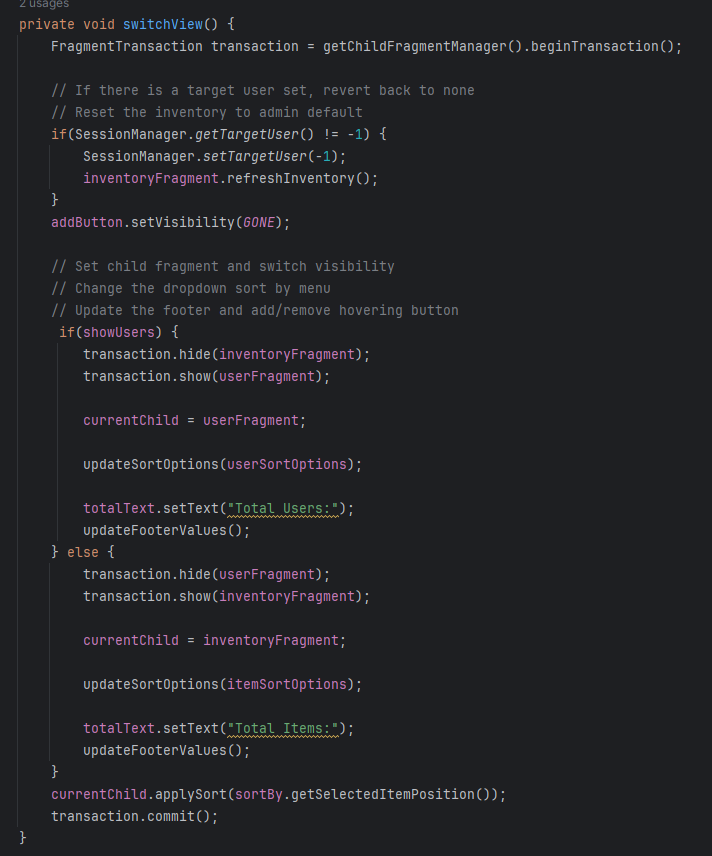

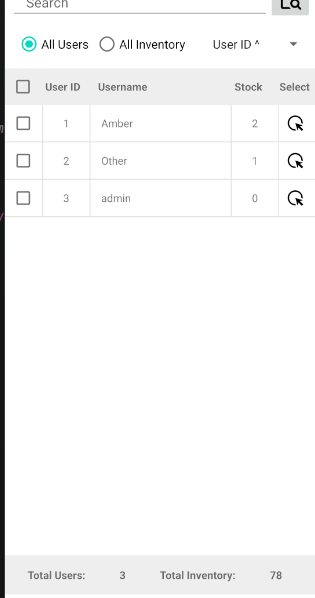 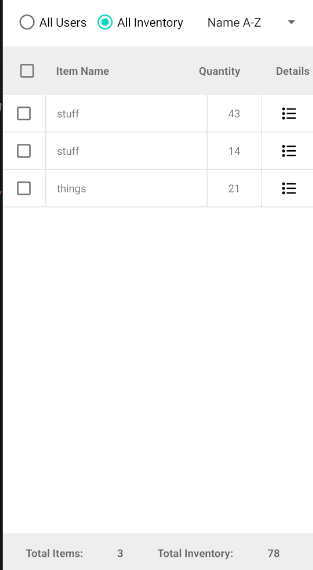 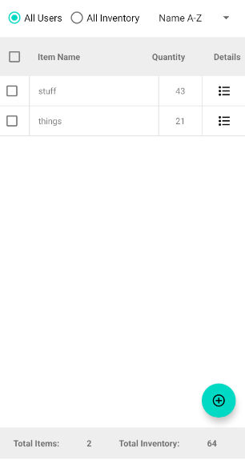

Login now requires a minimum of 8 characters for the password, as well as a capital letter and a number. The requirements are now visible after selecting “Sign up.” The password is hashed prior to entering the database for greater security. The role and userId are stored in a Session manager, which keeps account of the user logged in, the time since last active, and the target user selected during admin interactions as well.  For testing, the current way to create an admin account is to use the username **“admin.”** 

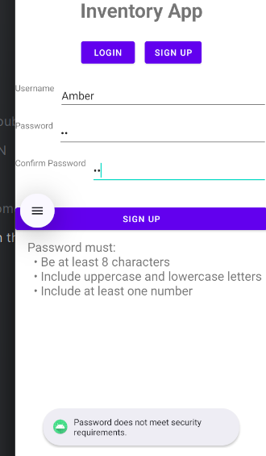 

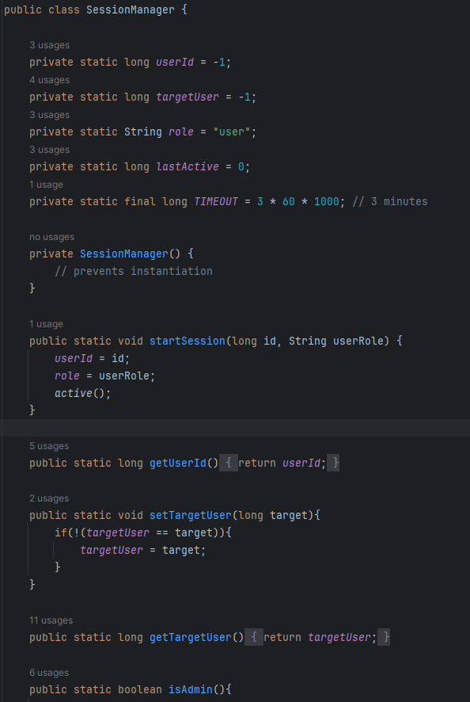 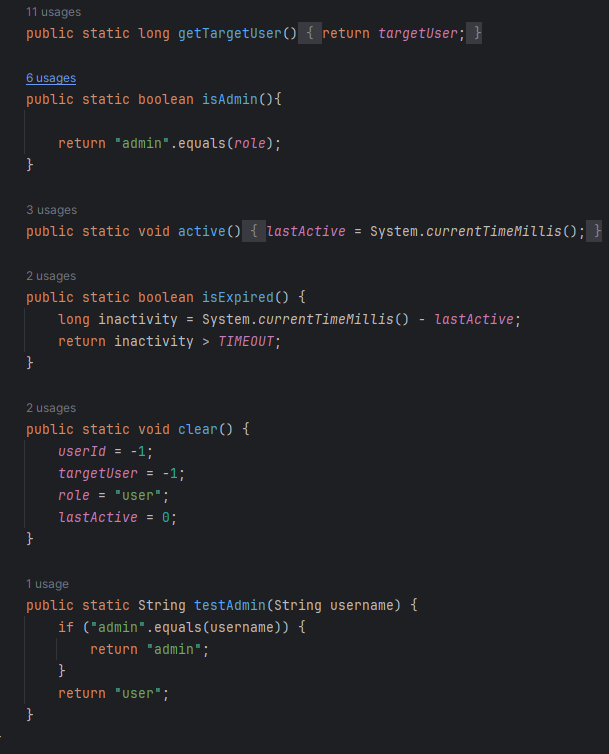

In the Item Details, the user is now able to set their low stock amount so they may be notified once that custom amount is hit for that particular item. The detail fragments are now dialogue fragments, allowing them to overlay the fragments they come from without needing to replace them entirely. This reduces navigation overhead and provides modern interaction. User Details are a new feature, with the only edit ability currently being the ability to change a user’s role. I disabled the ability for the logged in admin user from being able to edit or delete their own account, but they can still view their own details. The footer adapts by active Fragment, and calculates totals via new Database queries. They update after adding items, editing details, and deleting items or users.

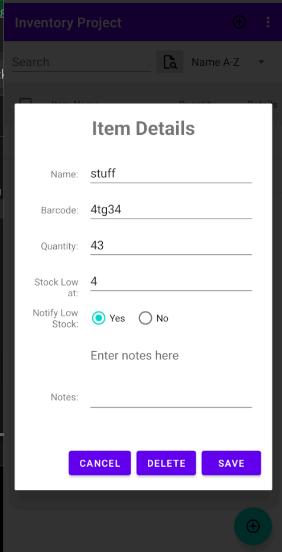

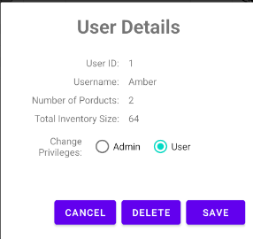 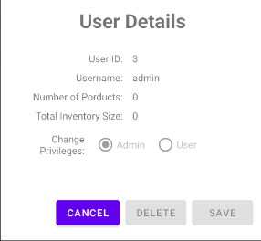

### Skills Demonstrated

* Application was restructured into a modular, fragment-based architecture that separates UI components and promotes reusability.
* Demonstrated object-oriented design by using fragments and dialog fragments to encapsulate specific responsibilities.
* Uses interface-based callbacks and fragment result communication to coordinate updates between independent components.
* Supports dynamic view switching within a single activity, improving usability while maintaining a clean and scalable navigation structure.
* Introduction of session-based user context allows the application to dynamically adjust behavior based on user role and selected target user.
* Added secure login validation and password hashing to promote security centered software development.

### Source Code

- [Original Source Code](https://github.com/newrosellc/CS-499-Capstone/blob/main/InventoryProjectCS360.zip)
- [Enhanced Project](https://github.com/newrosellc/CS-499-Capstone/blob/main/InventoryProjectUpdated.7z)
